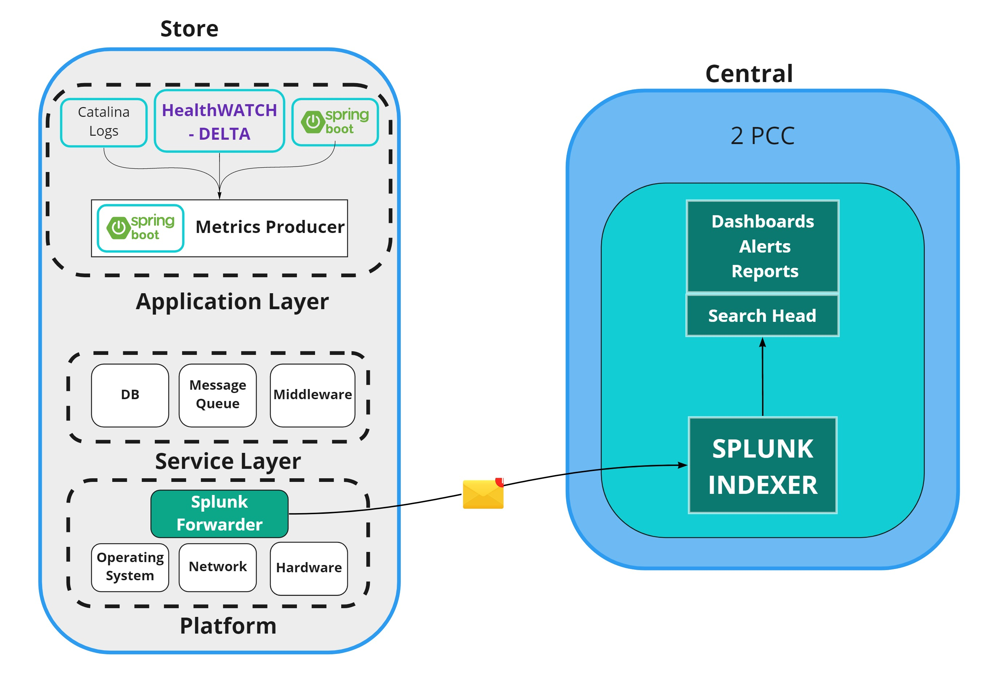

# Cautious_Monitor
### Project to extract System data by Team Falcon

##  Cautious_Monitor can monitor
###  -- Application health, 
###  -- Container Health (Ram, CPU, Disk, Load, etc) 
###  -- Verify if services/processes are running
###  -- Extract data from Databases
###  -- Extract lines from logs based on keywords

## Pre-Requisites
    System must have {Java} for the tool to execute
	
### Notes
	Works on a Spring Scheduler to verify the above.

	Refer to the swagger to also call these functionalities dynamically.

	Logs are collected with data, these can be loaded into any Logs analytics tool like ELK, Splunk or even PowerBI, etc

## Build & Package everything
    mvn clean install -DskipTests

## Execute
    Run the jar in the target folder - \sml_service\target: { java -jar Cautious_Monitor-1.0.0.jar }

## Current Schedule in Config

<table>
	<tr>
		<th>Metric</th>
		<th>Frequency</th>
	</tr>
	<tr>
		<td>Container Metrics</td>
		<td>Every 6 minutes</td>
	</tr>
	<tr>
		<td>Application Health Metrics</td>
		<td>Every 10 minutes</td>
	</tr>
	<tr>
		<td>Log Extraction Metrics</td>
		<td>Every 11 minutes</td>
	</tr>
	<tr>
		<td>Short-Term Database Queries</td>
		<td>Hourly</td>
	</tr>
	<tr>
		<td>Long-Term Database Queries</td>
		<td>Daily</td>
	</tr>
</table>

## API

### /appmetrics POST

Payload:

	    {
	        projectName(String) mandatory
	    	methodName(String) mandatory
	    	data(String) mandatory
	
	    	requestID(String) optional
	    	province(String) optional	
	    	responseCode(int) optional	
	    	responseTime(int) optional
	    }
	    
### /datatosplunk GET

Parameters: 
		
		message(String) mandatory

### /apphealthmetrics GET

### /getdbdata GET

Parameters:
	
		query(String) mandatory
		
		sendToSplunk(String) optional

### /containerhealthmetrics GET

Parameters:

		sendToSplunk(String) optional

### /logextractor GET

Parameters:

		filePath(String) mandatory
		searchKeyword(String) mandatory
		
		sendToSplunk(String) optional
		limit(int) optional	
    
## Documentation

### start.sh
    #!/bin/bash
    /usr/local/lib64/jdk8u202-b08/bin/java -Dserver.port=9254 -Dspring.config.location=c:/Cautious_Monitor_metrics/config/Cautious_Monitor-service-metrics.yml -Dlog4j.configurationFile=file:Cautious_Monitor_metrics/config/log4j2.properties -Xmx1024M -Xms256M -jar "c:/Cautious_Monitor_metrics/Cautious_Monitor-metrics-extractor-0.0.13.jar" &> c:/Cautious_Monitor_metrics/Cautious_Monitor_console.log &
    exit 0

### Top Level Architecture

